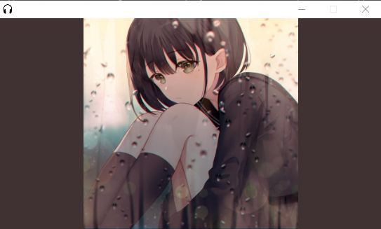
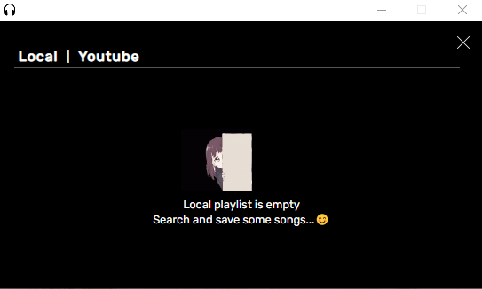

# Music Player - Electron

The Music Player - Electron is a desktop application built using the Electron framework and Innertube.js library. The application is designed to provide a minimalistic user interface that allows users to play and keep track of their favorite songs from both local and YouTube sources.

The main objective of this project is to provide a seamless music playing experience for users, with a focus on simplicity and ease of use. The application is built using Electron, a JavaScript framework that is used for creating desktop applications. Innertube.js is used to play music from YouTube, while the application's user interface is designed to be minimalistic and intuitive.

    
  Standby Mode - Interface 

    
  Player Interface

    
  Local Playlist

    
  Youtube Search Result

## Main Objectives

The main objectives of this project were to:

- Explore the capabilities of the Electron framework.
- Provide a seamless music playing experience for users.
- Learn more about DOM manipulation and server-side application development using Express.js.
- Gain knowledge of Innertube.js library for playing music from YouTube.
- Design a minimalistic user interface for better user experience.

## Key Features

The music player offers the following key features:

- Ability to play audio files from local machine and YouTube sources.
- Basic audio operations such as playing next, previous, loop, shuffle, and more.
- Download music from YouTube.
- Minimalistic design for a great user experience.

## What I've Learned

Through this project, I gained the following knowledge and skills:

- Understanding of Electron framework and its capabilities for building desktop applications.
- Knowledge of Innertube.js library for playing music from YouTube.
- Experience in designing a minimalistic user interface for better user experience.
- Understanding of DOM manipulation for building interactive user interfaces.
- Knowledge of server-side application development using Express.js.
- Understanding of audio playback and basic audio operations such as looping and shuffling.
- Knowledge of downloading music from YouTube.

## Quick Installation

1. Clone the repository to your local machine:

   `git clone https://github.com/FreddyWhest/Electron-music-app.git`

2. Navigate to the project directory:

   `cd your-repository`

3. Install the dependencies:

   `npm install`

4. Start the development server:

   `npm run start`

## Contributing

Contributions are welcome! If you want to contribute to the project, please follow these guidelines:

1. Fork the repository to your own GitHub account.

2. Clone the repository to your local machine:

   `git clone https://github.com/FreddyWhest/Electron-music-app.git`

3. Create a new branch for your changes:

   `git checkout -b your-branch-name`

4. Make your changes to the code.

5. Commit your changes:

   `git commit -m "Your commit message"`

6. Push your changes to your fork:

   `git push origin your-branch-name`

7. Create a pull request from your fork to the main repository.

## License

This project is licensed under the MIT License. See the LICENSE file for more information.
